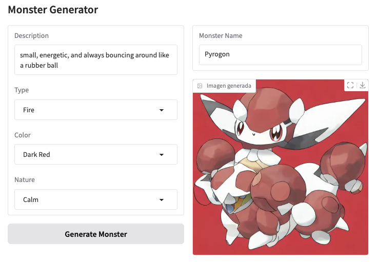

# ai-monster-generator

AI Monster Generator es una aplicación interactiva que utiliza modelos de inteligencia artificial para generar criaturas estilo Pokémon basadas en descripciones proporcionadas por el usuario. La aplicación está construida con Python y utiliza las bibliotecas `diffusers`, `torch` y `gradio`.

## Características

- Generación de imágenes de monstruos estilo Pokémon.
- Personalización basada en tipo, color, naturaleza y descripción.
- Interfaz interactiva con Gradio.
- Generación automática de nombres para los monstruos.

## Requisitos

Antes de ejecutar el proyecto, asegúrate de tener instaladas las siguientes dependencias:

- Python 3.8 o superior.
- Bibliotecas de Python:
  - `torch`
  - `diffusers`
  - `gradio`

## Instalación

1. Clona este repositorio:
   ```bash
   git clone https://github.com/tu-usuario/ai-monster-generator.git
   cd ai-monster-generator

2. Crea un entorno virtual (opcional pero recomendado):
  ```bash
  python -m venv venv
  source venv/bin/activate  # En Windows usa `venv\Scripts\activate`
  ```

3. Instala las dependencias:
  ```bash
  pip install -r requirements.txt
  ```

## Uso

1. Ejecuta la aplicación:
  ```bash
  python main.py
  ```

2. Accede a tu navegador en la dirección que se muestra en la consola (por defecto, `http://127.0.0.1:7860`).

```markdown

```

